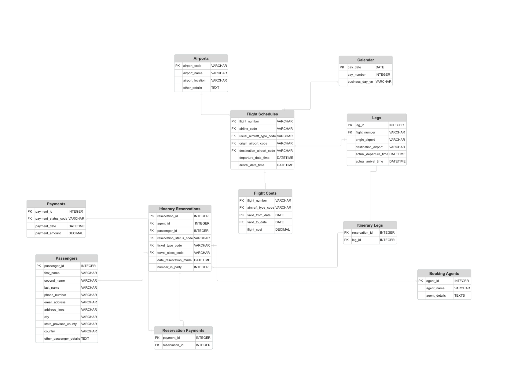

# Airline Reservation System — SQL Project

## 📌 Overview
This project was completed as part of **DSE6210: Big Data SQL and NoSQL**.  
It explores the **design, performance constraints, and scalability challenges** of an airline reservation system database.

## 🎯 Objectives
- Design relational tables to represent passengers, flights, reservations, and payments.  
- Analyze performance issues when handling customer queries **without SQL views**.  
- Compare scalability challenges in a **first-normal form (1NF) RDBMS**.  
- Demonstrate optimization strategies including **views, indexing, and partitioning**.  

## 🗂️ Deliverables
- **Entity Relationship Diagram (ERD)** – database schema for flights, customers, reservations, and itineraries.  
- **SQL Queries (`queries.sql`)** – table creation and queries including:  
  - `Passenger_Itinerary` view  
  - `Customers_On_Flight` view  
  - `Flights_By_Airport` view  
  - `Flight_Status` and `Flight_Sales` views  
- **Research Paper (`project-paper.pdf`)** – analysis of performance constraints and scaling strategies.  

## 🛠️ Key Insights
- Without views, repeated queries cause **performance bottlenecks** due to heavy joins.  
- **Indexes** on fields like `flight_number` and `passenger_id` improve query response times.  
- **Partitioning** large tables (e.g., `Itinerary_Reservations`) helps manage scaling in transactional systems.  
- For highly transactional apps, **NoSQL solutions (e.g., MongoDB, Cassandra)** may provide better scalability.  

## 📊 Visuals

## 📂 Repo Structure
/README.md ← this file

/erd-diagram-highres.png

/project-paper.pdf

/queries.sql

## 🔮 Next Steps
- Add **materialized views** to reduce query time for repeated joins.  
- Benchmark SQL performance vs. a **NoSQL alternative** for real-time scalability. 
